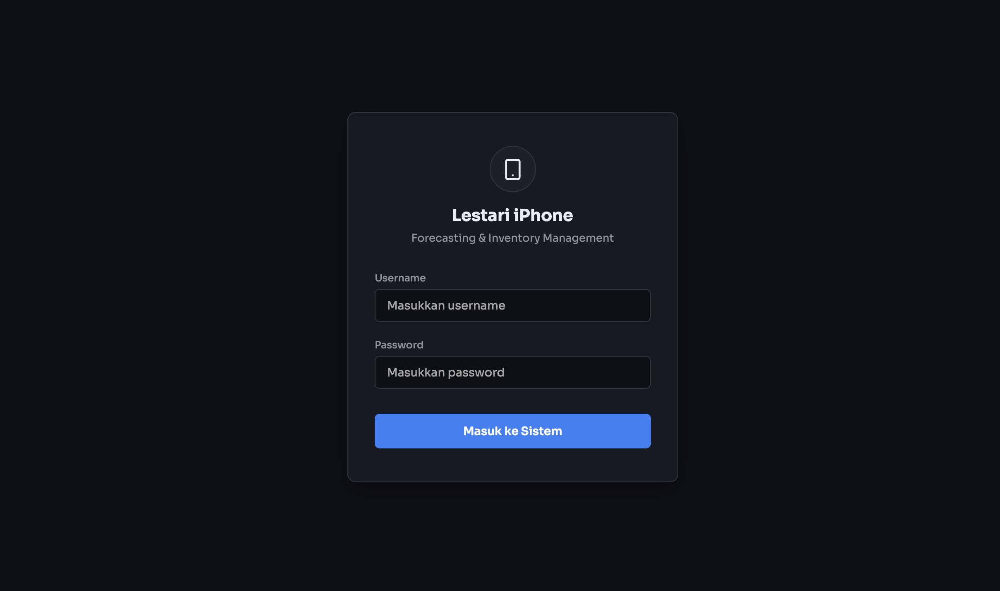
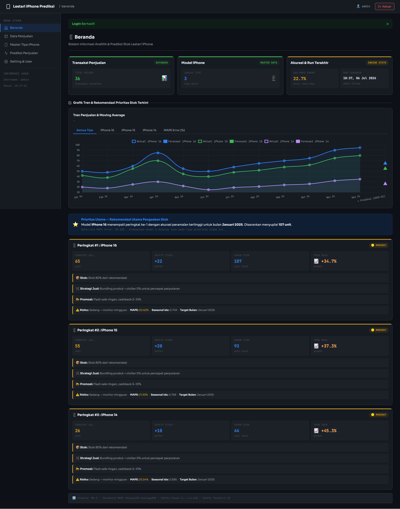
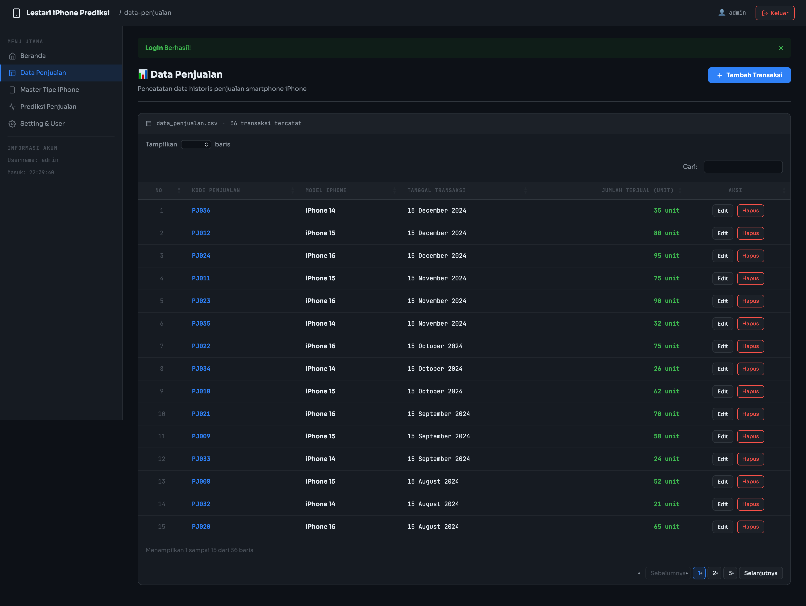
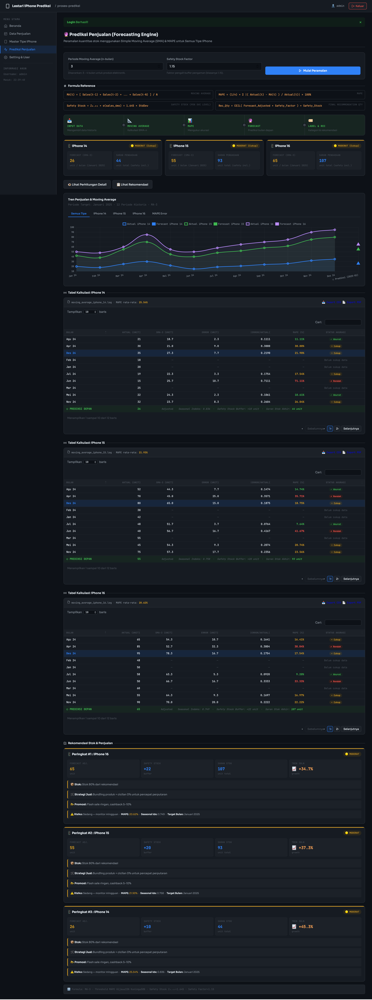
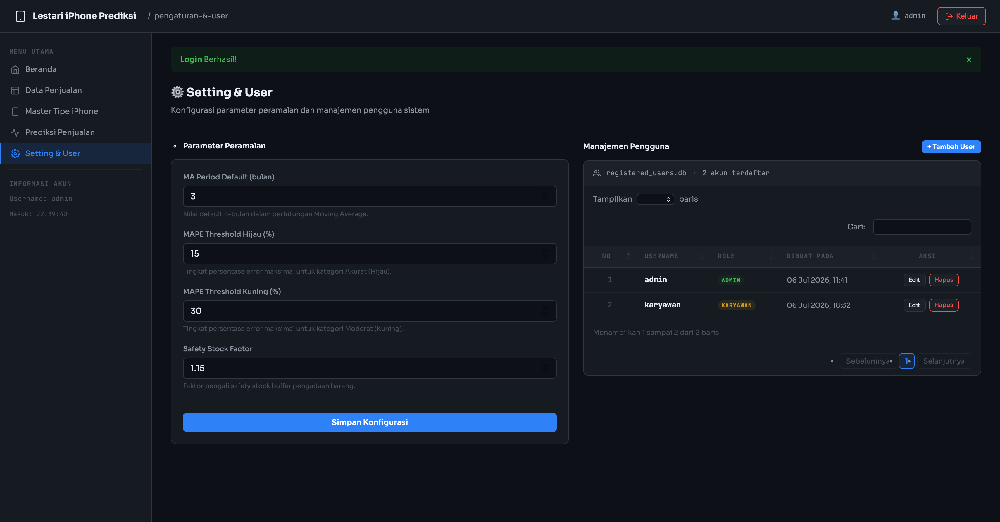

# 📱 Sistem Analitik & Prediksi Stok Lestari iPhone

Aplikasi sistem analitik dan peramalan (*forecasting*) penjualan iPhone berbasis web menggunakan kerangka kerja **CodeIgniter 3** dan database **MySQL**. Aplikasi ini menggunakan metode **Simple Moving Average (SMA)**, **Seasonal Index (Indeks Musiman)**, **Trend Analysis**, dan **Safety Stock** untuk memprediksi kebutuhan stok dan merumuskan saran pengadaan tipe iPhone 14, iPhone 15, dan iPhone 16 pada periode mendatang.

---

## 🛠️ Fitur Utama

1. **Dashboard Utama Dinamis (Beranda)**: Visualisasi grafik garis (*line chart*) interaktif menggunakan Chart.js untuk memantau tren aktual penjualan, pergerakan Moving Average, dan hasil proyeksi prediksi bulan berikutnya secara real-time. Dilengkapi dengan kartu rekomendasi prioritas stok berwarna (Merah/Kuning/Hijau) yang berisikan analisis tren, taktik penjualan, serta saran mitigasi risiko.
2. **Kelola Transaksi (Data Penjualan)**: CRUD data transaksi bulanan model iPhone.
3. **Master Tipe iPhone**: CRUD data master seri dan model iPhone yang terdaftar.
4. **Mesin Peramalan (Prediksi Penjualan)**: Antarmuka pemrosesan peramalan secara mendetail per tipe iPhone lengkap dengan visualisasi dan tabel perhitungan error MAPE (*Mean Absolute Percentage Error*). Dilengkapi fitur ekspor dokumen ke format PDF dan CSV.
5. **Pembagian Hak Akses (Role Permission)**: 
   - **Admin**: Akses penuh ke semua fitur termasuk menu peramalan, konfigurasi parameter peramalan, dan manajemen pengguna.
   - **Karyawan**: Akses terbatas hanya untuk melihat Beranda, mengelola Data Penjualan, dan mengelola Master Tipe iPhone (tidak dapat melihat/mengakses menu Prediksi Penjualan dan Pengaturan).
6. **Pengaturan & Manajemen User**: Halaman kontrol bagi Admin untuk memperbarui parameter (MA period, safety stock multiplier, MAPE threshold) dan mengelola akun pengguna sistem.

---

## 💻 Panduan Instalasi (XAMPP di macOS / Windows)

### 1. Persiapan File Project
Pindahkan atau salin folder project `forecasting_iphone` ke dalam direktori `htdocs` server XAMPP Anda:
- **macOS**: `/Applications/XAMPP/xamppfiles/htdocs/forecasting_iphone`
- **Windows**: `C:\xampp\htdocs\forecasting_iphone`

### 2. Impor Database
1. Buka control panel XAMPP dan jalankan modul **Apache** dan **MySQL**.
2. Masuk ke **phpMyAdmin** melalui browser di alamat: `http://localhost/phpmyadmin/`.
3. Buat database baru dengan nama `db_forecasting_iphone`.
4. Pilih database tersebut, masuk ke tab **Import**, klik **Choose File**, pilih berkas database `db_forecasting_iphone.sql` yang berada di direktori utama project, lalu klik **Go** / **Import**.

### 3. Konfigurasi Koneksi Database
Konfigurasi database berada di [application/config/database.php](file:///Applications/XAMPP/xamppfiles/htdocs/project/forecasting_iphone/application/config/database.php). Secara default, konfigurasi telah disetel sebagai berikut:
- Hostname: `127.0.0.1` (atau `localhost`)
- Username: `root`
- Password: *(kosong)*
- Database: `db_forecasting_iphone`

Jika Anda menggunakan kredensial MySQL yang berbeda pada XAMPP Anda, silakan sesuaikan file konfigurasi tersebut.

---

## 🔑 Kredensial Akun Default

Gunakan akun berikut untuk masuk ke dalam aplikasi:

| Role | Username | Password | Keterangan |
| :--- | :--- | :--- | :--- |
| **Admin** | `admin` | `admin` | Akses penuh ke seluruh sistem |
| **Karyawan** | *(Dapat dibuat oleh Admin di menu Setting & User)* | — | Akses terbatas |

---

## 🚀 Panduan Penggunaan Sistem

1. **Menjalankan Server**:
   - Anda dapat mengakses langsung lewat server Apache bawaan XAMPP di: `http://localhost/forecasting_iphone/`
   - Atau menjalankan PHP Development Server via Terminal di dalam folder project:
     ```bash
     php -S 127.0.0.1:8080
     ```
     Lalu akses di browser pada alamat: `http://127.0.0.1:8080/`.

2. **Melihat Analitik Beranda**:
   - Setelah login, Anda akan disambut oleh grafik tren penjualan interaktif.
   - Klik tab tipe iPhone di atas grafik untuk melihat grafik detail model tertentu beserta pergerakan garis Moving Average-nya.
   - Di bagian bawah grafik, terdapat kartu rekomendasi berwarna yang diurutkan dari prioritas pengadaan stok tertinggi.

3. **Membuat Prediksi Baru**:
   - Masuk sebagai **Admin**, pilih menu **Prediksi Penjualan** pada sidebar.
   - Klik tombol **Mulai Proses Peramalan**.
   - Sistem akan melakukan kalkulasi otomatis dan memunculkan tabel riwayat perhitungan lengkap dengan nilai error bulanan.
   - Anda dapat mengunduh dokumen laporan hasil peramalan ini dengan mengklik tombol **Export PDF** atau **Export CSV**.

4. **Menyesuaikan Parameter Peramalan**:
   - Masuk sebagai **Admin**, pilih menu **Setting & User**.
   - Anda dapat mengubah nilai **MA Period** (default: 3 bulan), **Safety Stock Factor** (default: 1.15), dan ambang batas (threshold) warna akurasi MAPE.

---

## 📸 Dokumentasi Antarmuka Sistem (Screenshots)

Berikut adalah beberapa tampilan halaman utama sistem peramalan iPhone:

### 1. Halaman Login

*Antarmuka masuk sistem yang aman.*

### 2. Dashboard Beranda (Visualisasi Grafik & Kartu Rekomendasi)

*Tampilan dashboard utama bertema gelap modern dengan grafik tren Chart.js dan kartu prioritas stok pengadaan.*

### 3. Halaman Transaksi Data Penjualan

*Daftar transaksi penjualan bulanan per tipe iPhone.*

### 4. Pemrosesan Prediksi Penjualan

*Halaman detail peramalan Simple Moving Average, indeks musiman, dan tabel data peramalan.*

### 5. Halaman Pengaturan Parameter & Manajemen Pengguna

*Konfigurasi parameter peramalan serta manajemen tambah/edit akun pengguna dan penetapan hak akses.*
